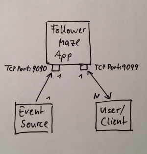

# Coding challenge Follower Maze

The [instructions.md](instructions.md) contains all the details for the task.

My solution implements a client server app.



## Prerequisites

The implementation was done using JAVA with the following tools:

| Tools | Version |
|---|---|
| Gradle | 4.10.2 |
| Java | 10.0.2 2018-07-17 |
| Eclipse | Oxygen.3a Release (4.7.3a) |
| JUnit | 4.12 |

Run 

```
./gradlew build
```

to create an executable JAR file.

Run 

```
./gradlew test
```

to run the implemented unit tests.

Run 

```
./gradlew run
```

or

```
java -jar .\build\libs\soundcloud-follower-maze-0.1.0.jar
```


to run the application.
